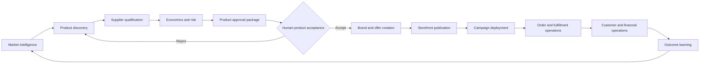
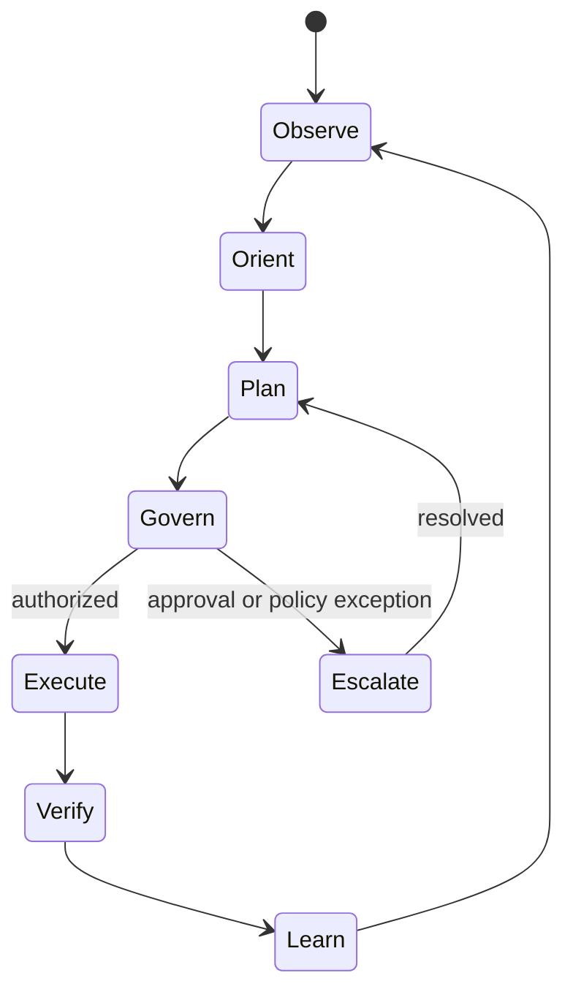
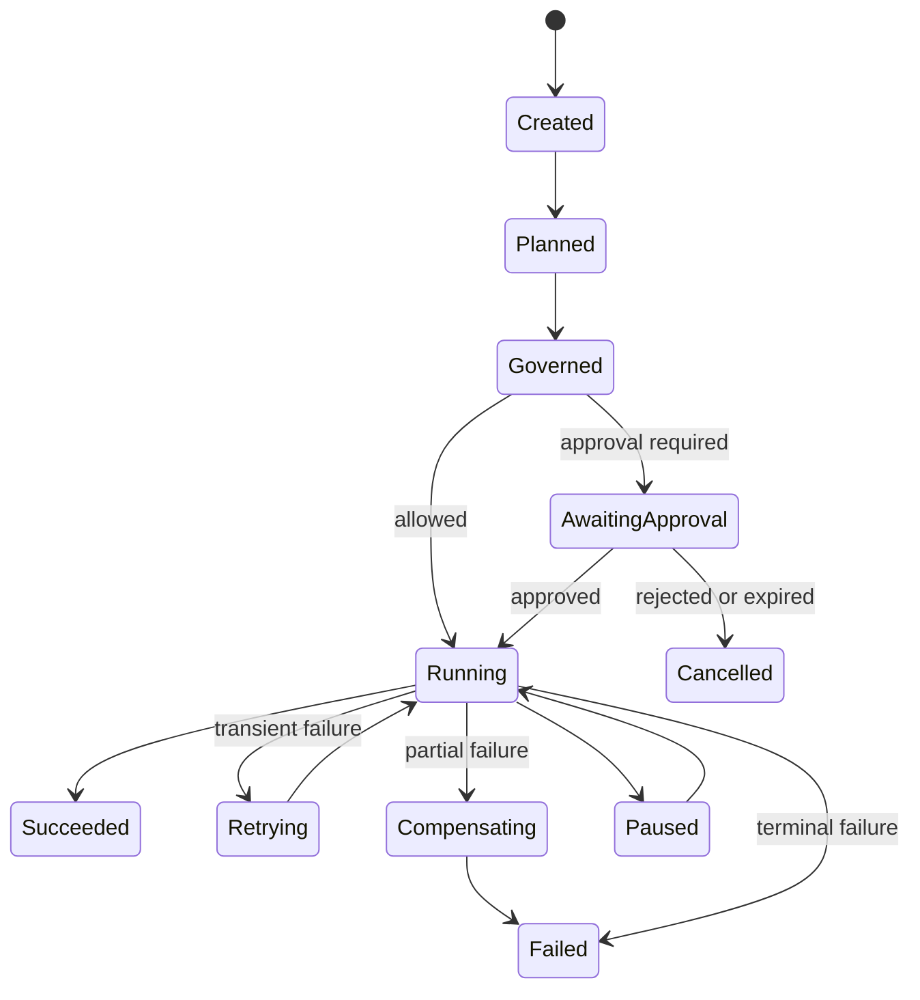

# Chapter 1 — ACOS Enterprise Blueprint

**System:** ACOS — Autonomous Commerce Operating System  
**Status:** Canonical  
**Scope:** Complete enterprise architecture blueprint  
**Authority:** ACOS Constitution  
**Implementation gate:** No runtime implementation may proceed until this chapter and its machine-readable registry validate successfully.

---

## 1.0 Enterprise context

ACOS is one integrated, AI-native commerce operating system that researches opportunities, qualifies products and suppliers, obtains the reserved human product-acceptance decision, creates and launches branded commerce offers, operates marketing and commerce workflows, monitors outcomes and learns continuously.

The enterprise boundary contains four domain groups:

1. **Commerce** — creates and realizes commercial value.
2. **Intelligence** — produces evidence-based decisions and coordinates activity.
3. **Governance** — preserves authority, legality, security, auditability and risk limits.
4. **Platform** — provides reliable execution, integration, data and operational infrastructure.

External systems are providers, never owners of ACOS business rules. Shopify, advertising networks, payment services, AI models, supplier platforms, voice services, databases and workflow engines are accessed through controlled adapters.

### External actors

- Human strategic authority
- Customers
- Suppliers and manufacturers
- Commerce platforms
- Marketing channels
- Payment and financial providers
- Logistics providers
- AI and data providers
- Regulators and auditors
- Engineering and operations personnel

### Reserved human authority

Human authority remains permanent for:

- constitutional amendment;
- expansion of autonomous authority;
- strategic risk appetite;
- acceptance or rejection of a product for launch;
- irreversible decisions designated by policy;
- exceptional financial exposure above delegated limits;
- emergency shutdown and recovery authorization.

Phase one reserves routine human participation to authenticated product acceptance. All normal activity after approval is designed to operate autonomously within policy.

---

## 1.1 Enterprise capability architecture

The detailed capability model is canonical in [01.1 Enterprise Capability Architecture](01.1-enterprise-capability-architecture.md).

Capabilities are stable business abilities and form the mandatory traceability bridge from Constitution to implementation. Every artifact must reference at least one approved capability identifier.

The phase-one value stream is:

---

## 1.2 Enterprise domain architecture

### Domain ownership model

Each domain owns its language, invariants, state transitions, authoritative records and public contracts. Domains communicate through versioned commands, queries and events. Direct writes into another domain's storage are prohibited.

### Commerce domains

- **Market:** opportunity, demand, competition and trend evidence.
- **Product:** product candidates, validation, portfolio and lifecycle.
- **Supplier:** supplier identity, offers, qualification, risk and performance.
- **Brand:** identity, positioning, claims, style and consistency.
- **Offer:** bundles, propositions, terms and merchandising.
- **Pricing:** cost, margin, pricing rules, recommendations and promotions.
- **Marketing:** audiences, campaigns, creatives, channels and optimization.
- **Sales:** conversion, promotions and channel performance.
- **Customer:** identity, consent, segmentation, support and retention.
- **Inventory:** availability, projection, buffers and stock risk.
- **Orders:** order state, payment coordination, cancellation and refunds.
- **Fulfillment:** routing, shipment, delivery, returns and logistics exceptions.
- **Finance:** revenue, cost, budget, margin, exposure, forecast and reconciliation.
- **Analytics:** metrics, experiments, attribution and outcome measurement.

### Intelligence domains

- **Executive Brain:** enterprise planning, prioritization, sequencing and conflict resolution.
- **Specialist Intelligence:** bounded analytical services for each commerce and governance domain.
- **Memory and Knowledge:** governed factual, episodic, semantic and procedural memory.
- **Learning:** evaluation, outcome attribution, model and policy improvement proposals.

### Governance domains

- **Policy:** machine-evaluable rules and decision constraints.
- **Approval:** reserved decisions, evidence packages and authenticated responses.
- **Risk:** identification, scoring, mitigation and exposure aggregation.
- **Compliance:** legal, regulatory, contractual and platform-rule evaluation.
- **Security:** identity, access, secrets and protective controls.
- **Audit:** immutable evidence and chain-of-custody records.
- **Constitution:** constitutional rules, validation and amendment control.

### Platform domains

- **Execution:** durable runs, steps, retries, compensation and scheduling.
- **Events:** envelopes, routing, delivery and replay.
- **Integration:** provider-neutral ports and anti-corruption adapters.
- **Data Platform:** persistence, schemas, migrations, lineage and retention.
- **Observability:** logs, metrics, traces, alerts and operational intelligence.
- **Configuration:** versioned environment and policy-safe configuration.
- **Deployment:** build, release, promotion and rollback.

### Boundary rule

No AI agent, n8n workflow, integration or user interface is a business domain. These are implementation mechanisms governed by domain contracts.

---

## 1.3 Enterprise event architecture

ACOS uses asynchronous domain events for completed facts and commands for requested actions.

### Event envelope

Every event contains:

- `event_id`
- `event_type`
- `event_version`
- `occurred_at`
- `recorded_at`
- `producer`
- `capability_id`
- `aggregate_type`
- `aggregate_id`
- `correlation_id`
- `causation_id`
- `execution_id`
- `tenant_id`
- `classification`
- `payload`
- `schema_ref`
- `idempotency_key`
- `trace_context`

### Delivery semantics

- At-least-once delivery is the default.
- Consumers must be idempotent.
- Ordering is guaranteed only within an aggregate stream where required.
- Durable outbox and inbox patterns protect database-to-event consistency.
- Poison messages enter a governed dead-letter process.
- Replay requires authorization, scope, dry-run validation and audit logging.

### Naming

Events use past tense: `product.candidate_discovered.v1`. Commands use imperative form: `product.qualify_candidate.v1`.

### Canonical phase-one events

- `market.opportunity_identified.v1`
- `product.candidate_discovered.v1`
- `product.validation_completed.v1`
- `supplier.qualification_completed.v1`
- `finance.unit_economics_calculated.v1`
- `risk.product_risk_assessed.v1`
- `approval.product_acceptance_requested.v1`
- `approval.product_accepted.v1`
- `approval.product_rejected.v1`
- `brand.identity_generated.v1`
- `offer.ready_for_publication.v1`
- `commerce.product_published.v1`
- `marketing.campaign_deployed.v1`
- `order.captured.v1`
- `fulfillment.shipment_updated.v1`
- `analytics.outcome_recorded.v1`
- `learning.improvement_proposed.v1`

---

## 1.4 Enterprise data architecture

### Data principles

- Domains own authoritative data.
- Shared databases do not imply shared ownership.
- Schemas and contracts are versioned.
- Every material datum has provenance, classification, retention and lineage.
- Derived data never silently replaces authoritative facts.
- AI-generated content is labeled with model, prompt/configuration version, evidence and confidence.

### Data classes

- Master data
- Transactional data
- Reference data
- Analytical data
- Operational telemetry
- Knowledge and memory
- Audit evidence
- Model and evaluation data

### Persistence model

PostgreSQL is the initial system of record. Domain schemas separate ownership. Object storage holds large immutable artifacts. Search/vector stores are derived indexes and never the sole authoritative source. Caches are disposable.

### Consistency

Strong consistency is required for authority, approvals, budgets, payment state, order transitions and audit identity. Eventual consistency is permitted for analytics, search, recommendations and non-critical projections.

### Retention and deletion

Retention is policy-driven by classification, legal obligation and operational need. Customer erasure requests must propagate through authoritative stores and derived indexes while preserving legally required audit evidence through lawful pseudonymization.

---

## 1.5 Enterprise service architecture

ACOS uses modular services aligned to bounded domains. A service may implement multiple closely related capabilities within one domain but may not absorb unrelated domain authority.

### Service contract rules

- Explicit versioned interfaces
- Schema validation at boundaries
- Authentication and authorization
- Idempotency for retried commands
- Defined timeouts and failure codes
- Audit context propagation
- Provider-independent business contracts
- Backward-compatible evolution where practical

### Interaction modes

- Commands for state-changing intent
- Queries for reads without side effects
- Events for completed facts
- Jobs for scheduled or deferred work
- Sagas/process managers for long-running cross-domain coordination

Distributed transactions across domains are prohibited. Long-running operations use compensating actions and explicit state machines.

---

## 1.6 Enterprise AI architecture

AI is a governed implementation of intelligence capabilities, not an independent authority.

### AI roles

- Evidence extraction
- Classification and scoring
- Forecasting and recommendation
- Content and creative generation
- Planning and task decomposition
- Anomaly detection
- Conversational and voice interaction

### Mandatory AI controls

Every AI decision records:

- objective;
- capability and domain;
- model and provider;
- model/configuration version;
- input references and provenance;
- policy context;
- output;
- confidence;
- uncertainty and assumptions;
- evaluation result;
- authority decision;
- human approval when applicable;
- cost, latency and token/resource use.

### Model abstraction

Models are accessed through provider-neutral ports. Routing may consider quality, risk, latency, availability, privacy and cost. Critical tasks require a deterministic validator, second-model review, rule-based check or human approval according to policy.

### Memory separation

- **Working memory:** execution-scoped and temporary.
- **Episodic memory:** prior decisions and outcomes.
- **Semantic memory:** curated facts and knowledge.
- **Procedural memory:** approved methods and playbooks.
- **Strategic memory:** human-approved objectives and constraints.

AI may propose memory changes; governed services validate, version and persist them.

---

## 1.7 Executive Brain architecture

The Executive Brain coordinates but does not own specialist domain truth.

### Responsibilities

- Translate strategy into measurable objectives.
- Build and maintain an enterprise plan.
- Select and sequence capability-driven work.
- Request specialist analysis.
- Resolve cross-domain conflicts through declared policies.
- Allocate attention and delegated budgets.
- Pause, retry, replan or escalate.
- Evaluate outcomes and initiate learning cycles.

### Decision cycle

### Plan contract

A plan includes objective, success metrics, constraints, assumptions, dependencies, tasks, owners, evidence requirements, budgets, deadlines, risk limits, approval gates, rollback strategy and completion criteria.

The Executive Brain may not edit the Constitution, change its own authority, bypass policy or directly mutate another domain's records.

---

## 1.8 Governance architecture

Every autonomous action passes through governance before execution.

### Governance sequence

1. Authenticate actor and execution context.
2. Resolve capability and requested authority.
3. Evaluate constitutional rules.
4. Evaluate domain policies.
5. Evaluate risk, confidence, budget and reversibility.
6. Determine `allow`, `deny`, `require_approval` or `allow_with_conditions`.
7. Record decision and evidence.
8. Enforce conditions during execution.
9. Verify outcome and close audit chain.

### Product acceptance

The approval package must contain product evidence, supplier evidence, economics, competition, risks, claims, proposed positioning, confidence and recommendation. Voice approval is accepted only after identity verification, explicit intent extraction, replay protection and durable recording of the interpreted decision.

### Fail-safe behavior

Governance failures fail closed for authority, financial exposure, production deployment, security, approval and irreversible actions.

---

## 1.9 Security architecture

ACOS applies zero-trust principles and least privilege.

### Security controls

- Strong workload and human identity
- Role- and attribute-based authorization
- Short-lived credentials
- Central secret management
- Encryption in transit and at rest
- Environment isolation
- Input and output validation
- Dependency and artifact integrity
- Tamper-evident audit records
- Data-loss prevention for restricted information
- Model prompt-injection and tool-abuse defenses
- Rate, budget and blast-radius limits

### AI-specific threats

Controls must address prompt injection, data exfiltration, tool misuse, hallucinated authority, poisoned memory, malicious supplier content, unsafe generated claims and model-provider compromise.

No untrusted external content may directly become instruction, policy or executable action.

---

## 1.10 Runtime and workflow architecture

n8n is an orchestration layer, not the source of business truth.

### Runtime responsibilities

- Create durable execution records.
- Resolve plan and capability context.
- Apply policy before side effects.
- Execute steps with idempotency.
- Persist state outside workflow memory.
- Retry transient failures safely.
- Compensate completed steps when required.
- Pause for approval or dependency.
- Resume from durable checkpoints.
- Emit events and telemetry.

### Execution state machine

### Runtime invariants

- Every side effect is associated with an execution and step.
- Step attempts are immutable records.
- Idempotency keys prevent duplicated external effects.
- A workflow definition is versioned and pinned for each run.
- Manual intervention is an explicit audited state transition.

---

## 1.11 Integration architecture

External providers are isolated behind ports and anti-corruption adapters.

### Adapter requirements

- Normalize provider data into domain contracts.
- Translate domain commands into provider operations.
- Validate signatures and responses.
- Enforce retries, timeouts, rate limits and circuit breakers.
- Record provider request IDs and raw evidence where permitted.
- Support sandbox and production environments.
- Expose provider health and quota state.
- Permit replacement without changing domain logic.

Initial adapter families include commerce, advertising, supplier, payment, logistics, communication, voice, AI model, analytics and identity providers.

---

## 1.12 Observability and operations architecture

Observability is part of correctness.

### Required telemetry

- Structured logs
- Business and technical metrics
- Distributed traces
- Audit events
- Model quality and cost metrics
- Policy decisions
- External provider health
- Data freshness and pipeline state

### Correlation

All telemetry propagates `trace_id`, `correlation_id`, `execution_id`, `step_id`, `capability_id`, `tenant_id` and relevant aggregate identifiers.

### Operational objectives

Each C3 and C4 capability defines service-level indicators, service-level objectives, error budgets, escalation paths and runbooks. Alerts must be actionable and linked to accountable ownership.

---

## 1.13 Deployment architecture

ACOS uses versioned, repeatable and reversible delivery.

### Environments

- Local development
- Automated test
- Staging
- Production

Production data and credentials are isolated. Promotion requires validated artifacts; rebuilding differently per environment is prohibited.

### Release controls

- Source-controlled configuration
- Automated tests and schema validation
- Dependency and secret scanning
- Signed or attributable artifacts
- Database migration safety checks
- Staged rollout for high-risk changes
- Automated rollback or forward-fix plan
- Post-deployment verification

Architecture, policy and schema registries are deployment dependencies and must be version-pinned.

---

## 1.14 Scalability and performance architecture

ACOS scales by stateless workers, partitioned workloads, asynchronous processing and bounded concurrency.

### Performance rules

- User and approval interactions receive explicit latency targets.
- Long-running AI and integration work is asynchronous.
- Backpressure protects providers and databases.
- Caches may improve reads but cannot become authoritative.
- Concurrency limits apply by tenant, capability, provider and budget.
- Expensive AI tasks use routing, batching and reuse where policy permits.

### Capacity dimensions

Planning must account for executions, events, products, suppliers, customers, orders, campaign objects, generated assets, model calls, stored evidence and audit records.

Scaling must preserve ordering, idempotency, isolation and governance.

---

## 1.15 Resilience, disaster recovery and continuity

### Resilience patterns

- Timeouts and bounded retries
- Circuit breakers
- Bulkheads
- Durable queues
- Idempotent consumers
- Checkpoints
- Compensation
- Provider fallback
- Degraded operating modes

### Recovery classes

C4 constitutional, approval, security, financial-integrity and audit services receive the strictest recovery objectives. C3 commerce execution services require tested recovery and replay. C1/C2 analytical services may tolerate longer restoration when no authoritative data is lost.

Backups must be encrypted, monitored and restoration-tested. Recovery procedures include database, object storage, registries, secrets, workflow versions and audit evidence.

Emergency mode may stop new side effects while preserving observation, evidence collection and recovery operations.

---

## 1.16 Enterprise delivery roadmap and architecture gates

### Blueprint-first sequence

1. Constitution
2. Enterprise blueprint
3. Domain architecture
4. Technical blueprint
5. Autonomous decision specifications
6. Implementation specifications
7. Runtime implementation
8. Controlled production activation

### Implementation gates

No implementation phase begins until:

- all chapter 1 sections are canonical;
- the blueprint registry validates;
- ownership and authority are explicit;
- phase-one value streams have contracts and failure behavior;
- security and governance controls are defined;
- event, data and runtime models are mutually consistent;
- outstanding design decisions are recorded as ADRs;
- acceptance and traceability requirements are complete.

### Phase-one implementation order after blueprint completion

1. Architecture validation and repository controls
2. Runtime persistence and Migration 002
3. Durable execution state machine
4. Event outbox/inbox
5. Governance and policy evaluation
6. Approval and authenticated voice decision
7. Executive Brain planning loop
8. Product, supplier, market and finance specialists
9. Brand, offer, storefront and marketing automation
10. Orders, fulfillment, customer and financial operations
11. Learning, evaluation and optimization
12. Production readiness and activation

---

## Enterprise traceability matrix

| Constitutional concern | Enterprise mechanism | Evidence |
|---|---|---|
| Human authority | Reserved decisions and approval domain | Approval record and identity proof |
| Governed autonomy | Policy evaluation before side effects | Policy decision and execution link |
| Auditability | Immutable correlated evidence | Audit event chain |
| Explainability | Evidence, confidence and reasoning summary | Decision record |
| Domain ownership | Bounded contexts and contracts | Registry ownership fields |
| Vendor independence | Ports and anti-corruption adapters | Adapter contract tests |
| Reliability | Durable runtime and event patterns | Execution history and SLOs |
| Security | Zero trust and least privilege | Access decision and security telemetry |
| Learning | Outcome attribution and governed proposals | Evaluation and change record |

---

## Enterprise acceptance criteria

Chapter 1 is complete only when:

- Sections 1.0 through 1.16 are canonical and mutually consistent.
- The detailed capability architecture is linked and authoritative.
- The machine-readable blueprint registry exists and validates.
- Domain ownership and reserved human authority are unambiguous.
- Event, data, service, AI, governance, security, runtime and integration rules are implementation-ready.
- State machines and primary value streams are defined.
- Failure, recovery, deployment and scale rules are explicit.
- ADRs record foundational decisions.
- README and architecture indexes identify Chapter 1 as complete.
- No placeholder or unresolved architecture choice blocks Migration 002.

---

## Final enterprise rule

ACOS must remain one integrated machine composed of bounded, accountable domains. Intelligence may recommend and coordinate; governance authorizes; the runtime executes; domains own truth; the human retains permanent strategic authority. No implementation convenience may override this model.
